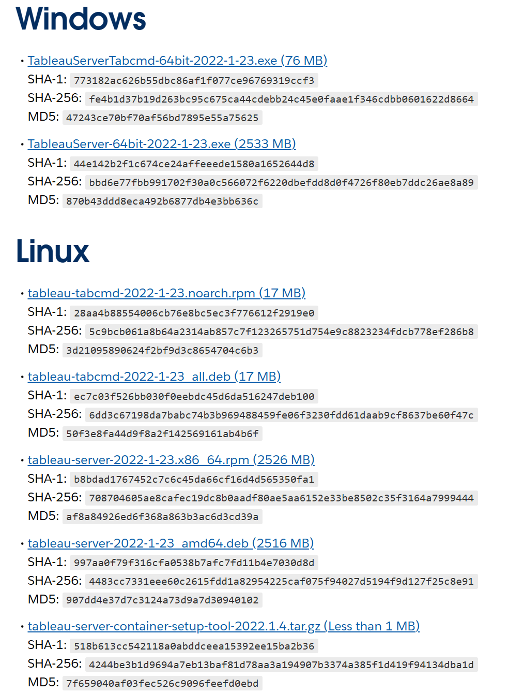
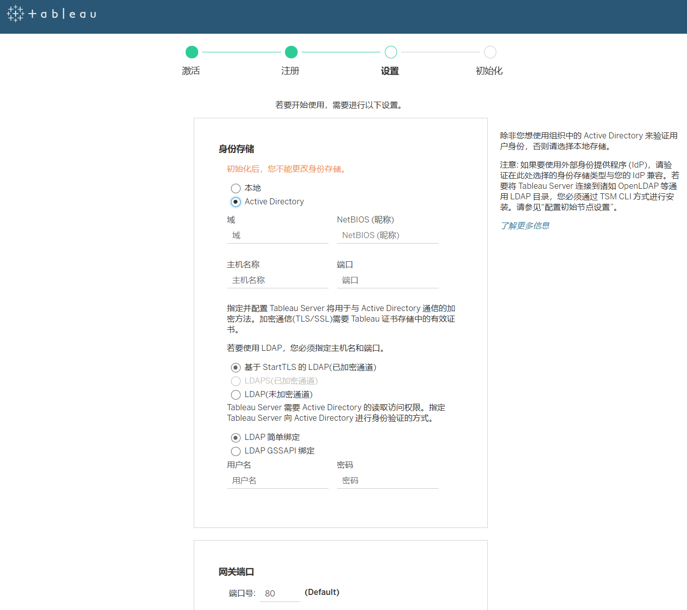

# Tableau server 安装

# 安装步骤
此教程主要介绍安装和配置TableauServer的步骤，且只针对单节点。 运行安装之后，必须通过激活许可证、注册TableauServer和配置包括身份验证 在内的各种设置来继续进行设置，主要有以下步骤：
1. 安装和初始化TSM
2. 激活并注册TableauServer 
3. 添加管理员帐户 
4. 验证安装
## 一、安装前准备

1. 硬件需求: 版本 2022.1 及更低版本至少8核16g，版本 2022.3 及更高版本内存至少64g。
2. 操作系统要求: 确保服务器操作系统满足要求，目前支持的操作系统包括:
- RHEL 7.3 及更高版本
- CentOS 7.3 及更高版本
- Oracle Linux 7.3 及更高版本
- Ubuntu 16.04 LTS 及更高版本

- 准备专用用户来安装Tableau Server
```
useradd -m tabadmin
passwd tabadmin
usermod -aG wheel tabadmin

su - tabadmin
```

## 二、安装 Tableau Server 软件包

点进目前官网发现有以下大版本：2023.3 2023.1 2022.3 2022.1 2021.4 2021.3 2021.2  [https://www.tableau.com/support/releases/server](https://www.tableau.com/support/releases/server)  
点击需要的版本找到下载地址（2022.1.23为例）
[https://www.tableau.com/support/releases/server/2022.1.23#esdalt](https://www.tableau.com/support/releases/server/2022.1.23#esdalt)  
这里可以看到2022.1.23的linux安装包下载地址是
[https://downloads.tableau.com/esdalt/2022.1.23/tableau-server-2022-1-23.x86_64.rpm](https://downloads.tableau.com/esdalt/2022.1.23/tableau-server-2022-1-23.x86_64.rpm)，一般用wget下载  



1. 下载适用于 Linux 的 Tableau Server 安装包
```
wget https://downloads.tableau.com/esdalt/2022.1.23/tableau-server-2022-1-23.x86_64.rpm
```

1. 运行安装脚本
```
sudo yum install tableau-server-2022-1-23.x86_64.rpm -y


[2024-06-03 09:59:42]  If this is a single node or initial node installation, run:
[2024-06-03 09:59:42]      sudo /opt/tableau/tableau_server/packages/scripts.20221.24.0308.1659/initialize-tsm --accepteula
[2024-06-03 09:59:42]  to continue setting up Tableau Server. If this installation is part of a multi-node configuration,
[2024-06-03 09:59:42]  see the online documentation for installing Tableau Server on additional nodes.
[2024-06-03 09:59:42]  
  Verifying  : tableau-server-20221.24.0308.1659-20221-24.0308.1659.x86_64                                    1/1 
[2024-06-03 09:59:43]  Installed:
[2024-06-03 09:59:43]    tableau-server-20221.24.0308.1659.x86_64 0:20221-24.0308.1659                                                  
[2024-06-03 09:59:43]  Complete!
```

## 三、初始化TSM

1. 初始化TSM，关闭ATR激活选项
```
sudo /opt/tableau/tableau_server/packages/scripts.<version>/initialize-tsm --accepteula --no-activation-service

[2024-06-03 10:01:01]  Creating 'tsmadmin' group for TSM admin authorization
[2024-06-03 10:01:01]  Creating 'tableau' unprivileged user account
[2024-06-03 10:01:01]  Creating environment file...
[2024-06-03 10:01:01]  Creating directories and setting permissions...
[2024-06-03 10:01:01]  Using '/var/opt/tableau/tableau_server' as the data directory.
[2024-06-03 10:01:01]  Adding user 'tabadmin' to group 'tableau'...
[2024-06-03 10:01:01]  Adding user 'tabadmin' to group 'tsmadmin'...
[2024-06-03 10:01:01]  Added. Note: These group membership changes do not take effect in shells already open. For these to take effect, log out of the shell and log back in.
[2024-06-03 10:01:01]  Tableau Server runs best with at least 50 GB of free disk space,
[2024-06-03 10:01:01]  but found only 35 GB for the data directory '/var/opt/tableau/tableau_server'. Continuing.
[2024-06-03 10:01:01]  Starting TSM services...
[2024-06-03 10:01:08]  Updating repository version in Tableau Server Coordination Service.
[2024-06-03 10:03:27]  TSM services started successfully
[2024-06-03 10:03:30]  Use the 'tsm' command to continue setting up Tableau Server.
[2024-06-03 10:03:30]  >> Tableau binary directory will be added to PATH for new shells. To get the
[2024-06-03 10:03:30]  >> updated path, either start a new session, or for bash users run:
[2024-06-03 10:03:30]  >> source /etc/profile.d/tableau_server.sh
[2024-06-03 10:03:30]  The TSM administrative web interface (and REST API) is now available at
[2024-06-03 10:03:30]  https://iZbp1587od7awm8s4ol6j2Z:8850
[2024-06-03 10:03:30]  You can continue the configuration and initialization of Tableau server using either the TSM command line interface,
[2024-06-03 10:03:30]  or the web interface.
[2024-06-03 10:03:30]  You will be prompted to authenticate, or can log in using the username 'tabadmin', with the same password you used to log into this session. You could also use any username, with its password, from the administrative group in the domain.
[2024-06-03 10:03:30]  Done.
```

note：可以用以下命令，查看日志判断初始化进度
```
sudo tail -f /var/opt/tableau/tableau_server/data/tabsvc/logs/tabadmincontroller/tabadmincontroller_node1-0.log

[2024-06-03 12:39:22]  2024-06-03 12:39:52.013 +0800  pool-21-thread-1 : INFO  com.tableausoftware.tabadmin.webapp.impl.status.ServiceStatusWatcher - 34 services have reached their expected state
[2024-06-03 12:39:52]  2024-06-03 12:39:52.013 +0800  pool-21-thread-1 : INFO  com.tableausoftware.tabadmin.webapp.impl.status.ServiceStatusWatcher - node1 has 6 services that aren't running: vizportal_0.20221.24.0308.1659 (deployment state: ENABLED, process status: DOWN), backgrounder_0.20221.24.0308.1659 (deployment state: ENABLED, process status: DOWN), vizqlserver_0.20221.24.0308.1659 (deployment state: ENABLED, process status: DOWN), flowprocessor_0.20221.24.0308.1659 (deployment state: ENABLED, process status: STATUS_UNAVAILABLE), minerva_0.20221.24.0308.1659 (deployment state: ENABLED, process status: DOWN), dataserver_0.20221.24.0308.1659 (deployment state: ENABLED, process status: DOWN)
```

## 四、激活和注册Tableau Server

1. 初始化成功后，推荐使用 TSM Web 界面，或用命令行激活和注册 Tableau Server:
- TSM Web 界面激活和注册: 访问 <https://hostname:8850>，在UI页面上进行激活、注册、设置、初始化
- 命令行激活和注册
```
tsm licenses activate -k <product-key>
tsm licenses activate-t  #激活试用版

tsm register--template > /path/to/<registration_file>.json
tsm register --file /path/to/registration_file.json

registration_file.json
{
 "first_name" : "Andrew",
 "last_name" : "Smith",
 "phone" : "311-555-2368",
 "email" : "andrew.smith@mycompany.com",
 "company" : "My Company",
 "industry" : "Finance",
 "company_employees" : "500",
 "department" : "Engineering",
 "title" : "Senior Manager",
 "city" : "Kirkland",
 "state" : "WA",
 "zip" : "98034",
 "country" : "United States",
 "opt_in" : "true",
 "eula" : "true
 }

tsm register--file /usr/share/tableau-reg-file.json
```

2. 配置身份存储、网关端口等必要设置，可以使用 TSM Web 界面或命令行，对应（可选）
```
tsm settings import-f path-to-file.json

path-to-file.json:
{
 "configEntities": {
 "gatewaySettings": {
 "_type": "gatewaySettingsType",
 "port": 80,
 "publicHost": "localhost",
 "publicPort": 80
 },
 "identityStore": {
 "_type": "identityStoreType",
 "type": "local",
 "domain": "example.lan",
 "nickname": "EXAMPLE"
 }
 },
 "configKeys": {
 "gateway.timeout": "900"
}
```
对应TSM Web界面的设置页面，身份存储和网关端口  


1. 创建初始管理员账号
```
tabcmd initialuser --server http://<hostname> --username "<admin-username>" --password "<password>"

tabcmd initialuser --username brucegavin --server http://localhost #这种方式避免密码暴露
```

## 五、验证安装

1. 访问 Tableau Server 的 Web 界面，使用初始管理员账号登录，导入数据源、发布工作簿等，检查各项功能是否正常。
2. 或者用命令行检查各进程和服务的状态:
```
tsm status -v
```

## 六、其他

如果用root安装了Tableau server，在后面的初始化会出现报错
```
User 'root' has been selected as the user to add to the TSM authorized group, but TSM does not allow root as a TSM-authorized user. You must either re-run this script using 'sudo' while logged in as a normal user instead of root (most common case), rerun this script with the '-a username' option to select a user other than root to add to the group, or the '-g' flag to disable group addition completely and add appropriate users to the group yourself. Canceling.
```

可以用下面的命令完全卸载Tableau Server
```
sudo /opt/tableau/tableau_server/packages/scripts.<version_code>/tableau-server-obliterate -a -y -y -y -l
```

升级的话需要先停止tsm，再运行升级脚本，试用版本不能用这个脚本直接升级
```
tsm stop

sudo /opt/tableau/tableau_server/packages/scripts.<version_code>/upgrade-tsm --accepteula

tsm start
```

备份和还原数据
```
(/var/opt/tableau/tableau_server/data/tabsvc/files/backups/ts_backup-2024-06-03.tsbak, #数据的备份文件路径
/home/tabadmin/tss_backup.json) #设置的备份文件路径

tsm maintenance backup -f ts_backup -d -po 
tsm maintenance restore --file ts_backup-2024-06-03.tsbak

tsm settings import -f <filename>.json
tsm pending-changes apply
tsm restart
```
# 考试指南 部分

请注意：这不是本考试内容的全面清单。
[https://www.tableau.com/zh-cn/learn/certification/tableau-server-certified-associate-exam-guide](https://www.tableau.com/zh-cn/learn/certification/tableau-server-certified-associate-exam-guide)

### 领域 1：连接到数据并准备数据

**1.1 用户体验**

- 1.1.1 UI
- 1.1.2 导航

**1.2 拓扑**

- 1.2.1 确定客户端组件
- 1.2.2 确定服务器组件
- 1.2.3 说明二者如何配合工作

**1.3 版本**

- 1.3.1 了解：
  - 1.3.1.1 如何确定 Tableau Server 的当前版本
  - 1.3.1.2 从何处获取最新版本的 Tableau Server
  - 1.3.1.3 在何处查看 Tableau Server 的版本说明

**1.4 最低硬件要求**

- 1.4.1 了解：
  - 1.4.1.1 RAM 要求
  - 1.4.1.2 CPU 要求
  - 1.4.1.3 硬盘要求

**1.5 软件要求**

- 1.5.1 列出支持的操作系统
- 1.5.2 了解：

  - 1.5.2.1 浏览器要求
  - 1.5.2.2 电子邮件通知选项
  - 1.5.2.3 防病毒问题
  - 1.5.3 确定 SMTP 服务器
  - 1.5.4 熟悉潜在的端口问题
  - 1.5.5 解释专用服务器的用途和好处
  - 1.5.6 确定云端运行的注意事项

**1.6 许可**

- 1.6.1 了解基于用户能力的授权
- 1.6.1.1 说明不同的许可证类型
- 1.6.1.2 说明许可证类型如何映射到站点角色

**1.7 Server 进程**

- 1.7.1 说明每个 Tableau 服务管理器和 Tableau Server 进程
- 1.7.2 了解：

  - 1.7.2.1 安装时的默认进程数
  - 1.7.2.2 多实例进程
  - 1.7.2.3 流程到流程工作流
  - 1.7.2.4 分布式环境和高可用性环境中的进程
  - 1.7.2.5 负载均衡器的用途

**1.8 数据源识别**

- 1.8.1 确定所需的端口
- 1.8.2 确定所需的数据库驱动程序
- 1.8.3 了解以下区别：

  - 1.8.3.1 文件、关系与多维数据集
  - 1.8.3.2 数据提取与实时连接
- 1.8.4 说明已发布数据源的优势

**1.9 基础结构网络**

- 1.9.1 了解网络延迟含义
- 1.9.2 说明动态 IP 寻址的风险

### 领域 2：安装和配置

**2.1 安装**

- 2.1.1 了解安装步骤和选项

  - 2.1.1.1 安装路径
  - 2.1.1.2 网关端口
- 2.1.2 了解身份存储区和 SSO 选项：

  - 2.1.2.1 外部 (Active Directory) 与本地
  - 2.1.2.2 受信任票证
  - 2.1.2.3 SAML
  - 2.1.2.4 Kerberos 和 OpenID Connect
- 2.1.3 说明自动登录选项的影响
- 2.1.4 了解如何设置 SSL
- 2.1.5 了解在单一计算机环境中安装 Tableau 的最佳做法
- 2.1.6 了解静默安装

**2.2 Tableau Server 配置**

- 2.2.1 了解缓存设置
- 2.2.2 了解如何：

  - 2.2.2.1 应用进程分布
  - 2.2.2.2 配置电子邮件通知/订阅
  - 2.2.2.3 配置可选自定义
- 2.2.3 描述：

  - 2.2.3.1 站点配置选项
  - 2.2.3.2 用户配额 2.2.3.3 存储配额
  - 2.2.3.4 如何启用和编辑站点订阅
  - 2.2.3.5 项目配置选项
  - 2.2.3.6 分组和用户配置选项
- 2.2.4 了解谁可以添加用户

**2.3 添加用户**

- 2.3.1 许可证类型和站点角色
- 2.3.2 管理员级别
- 2.3.3 发布者级别
- 2.3.4 通过 Active Directory 或本地导入

**2.4 安全性**

- 2.4.1 描述以下项的安全配置：
  - 2.4.1.1 站点级别
  - 2.4.1.2 项目级别
  - 2.4.1.3 组级别
  - 2.4.1.4 用户级别
  - 2.4.1.5 数据源级别
  - 2.4.1.6 工作簿级别

**2.5 权限**

- 2.5.1 了解：
  - 2.5.1.1 系统权限组成
  - 2.5.1.2 权限设计的分支
  - 2.5.1.3 Tableau 安全模型
  - 2.5.2 描述“允许”、“拒绝”和“无”之间的差异

### 领域 3：管理

**3.1 了解如何：**

- 3.1.1 维护数据连接
- 3.1.2 创建计划
- 3.1.3 创建、编辑和删除订阅
- 3.1.4 执行服务器分析
- 3.1.5 完成备份和还原
- 3.1.6 执行清理
- 3.1.7 添加、删除或停用用户
- 3.1.8 更新许可证
- 3.1.9 启动、停止或重启
- 3.1.10 使用 tsm 和 tabcmd
- 3.1.11 使用 REST API
- 3.1.12 使用日志文件
- 3.1.13 了解嵌入
- 3.1.14 监视 Desktop 许可证使用
- 3.1.15 管理工作簿和数据源修订历史记录

**3.2 描述如何：**

- 3.2.1 以多种方法查看服务器状态
- 3.2.2 查看电子邮件通知
- 3.2.3 设置数据驱动型通知
- 3.2.4 使用内置管理视图
- 3.2.5 创建自定义管理视图
- 3.2.6 创建性能记录
- 3.2.7 创建嵌套项目
- 3.2.8 使用站点和站点管理选项

**3.3 将最终用户能力与系统管理员能力进行对比**

**3.4 最终用户能力**

**3.5 了解：**

- 3.5.1 表建议
- 3.5.2 发布视图和数据源
- 3.5.3 重命名工作簿
- 3.5.4 通过 Web 与视图交互
- 3.5.5 Web 制作和编辑
- 3.5.6 如何共享视图
- 3.5.7 数据源认证
- 3.5.8 提取缓存

### 领域 4：故障排除

**4.1 了解浏览器中第三方 cookie 的要求**

**4.2 了解如何：**

- 4.2.1 重置 Tableau 用户或 Tableau 运行身份服务帐户的密码
- 4.2.2 打包日志文件以进行报告
- 4.2.3 使用 tsm 验证站点资源
- 4.2.4 重新生成搜索索引
- 4.2.5 使用维护分析报告
- 4.2.6 创建/打开支持请求

### 领域 5：迁移和升级

**5.1 了解升级过程**

**5.2 说明执行干净重装的方法及原因**

**5.3 描述如何迁移到不同的硬件**

**5.4 了解向后兼容性**

<Comment />
