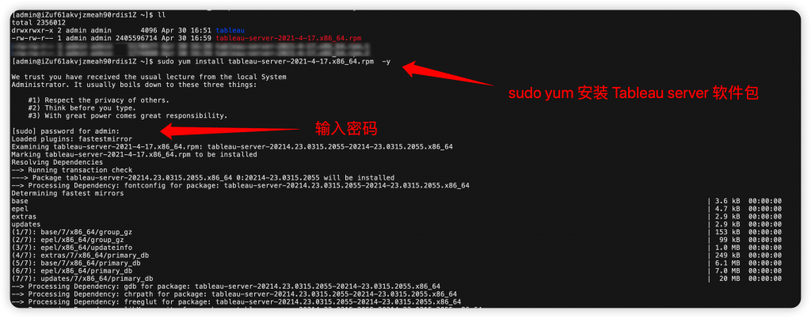

# Tableau server 安装

# 安装步骤

## 一、安装前准备

1. 硬件需求:根据 Tableau Server 的部署规模，准备合适配置的服务器，至少应满足最低硬件要求。
2. 操作系统要求:确保服务器操作系统满足要求，目前支持的操作系统包括:

- RHEL 7.3 及更高版本
- CentOS 7.3 及更高版本
- Oracle Linux 7.3 及更高版本
- Ubuntu 16.04 LTS 及更高版本

1. 网络和目录配置:

- 确保主机名(hostname)符合要求，将其添加到 hosts 文件中

```markdown
hostnamectl set-hostname <新主机名>
```

- 创建数据目录，确保运行 Tableau Server 进程的用户对相应目录有读写权限

## 二、安装 Tableau Server 软件包



1. 下载适用于 Linux 的 Tableau Server 安装包，解压缩到安装目录，例如:

```
tar -xvf tableau-server-<version>.x86_64.rpm
```

1. 运行安装脚本:

```
sudo ./initialize-tsm --accepteula
```

## 三、初始化和激活 Tableau Server

1. 初始化 Tableau 服务管理器(TSM):

```
sudo /opt/tableau/tableau_server/packages/scripts.<version>/initialize-tsm --accepteula
```

1. 使用 TSM Web 界面或命令激活 Tableau Server:

- Web 界面:访问 <https://hostname:8850>
- 命令行:

```
tsm licenses activate -k <product-key>
```

1. 注册 Tableau Server:

```
tsm register --file /path/to/registration_file.json
```

## 四、配置初始设置

1. 配置身份存储、网关端口等必要设置，可以使用 TSM Web 界面或命令行:

```
tsm configuration set -k wgserver.authenticate -v local
tsm configuration set -k gateway.public.port -v 80
```

1. 创建初始管理员账号:

```
tabcmd initialuser --server http://<hostname> --username "<admin-username>" --password "<password>"
```

## 五、应用配置并启动服务器

1. 应用 pending 状态的配置并重启服务器:

```
tsm pending-changes apply
```

1. 初始化并启动 Tableau Server:

```
tsm initialize --start-server --request-timeout 1800
```

## 六、验证安装

1. 访问 Tableau Server 的 Web 界面，使用初始管理员账号登录，导入数据源、发布工作簿等，检查各项功能是否正常。
2. 检查各进程和服务的状态:

```
tsm status -v
```

## 七、其他配置

1. 生成引导文件以进行多节点部署:

```
tsm topology nodes get-bootstrap-file --file /tmp/bootstrap.json
```

1. 根据需要配置身份认证、数据源、网络代理、SMTP 等各项设置。
2. 执行安全加固，如:禁用未使用的服务、配置 SSL/TLS、设置会话生命周期等。
3. 定期检查 Tableau Server 的运行状态，确保及时更新到最新版本并打上必要的安全补丁。

# 考试指南 部分

请注意：这不是本考试内容的全面清单。

[https://www.tableau.com/zh-cn/learn/certification/tableau-server-certified-associate-exam-guide](https://www.tableau.com/zh-cn/learn/certification/tableau-server-certified-associate-exam-guide)

### 领域 1：连接到数据并准备数据

**1.1 用户体验**

- 1.1.1 UI
- 1.1.2 导航

**1.2 拓扑**

- 1.2.1 确定客户端组件
- 1.2.2 确定服务器组件
- 1.2.3 说明二者如何配合工作

**1.3 版本**

- 1.3.1 了解：
  - 1.3.1.1 如何确定 Tableau Server 的当前版本
  - 1.3.1.2 从何处获取最新版本的 Tableau Server
  - 1.3.1.3 在何处查看 Tableau Server 的版本说明

**1.4 最低硬件要求**

- 1.4.1 了解：
  - 1.4.1.1 RAM 要求
  - 1.4.1.2 CPU 要求
  - 1.4.1.3 硬盘要求

**1.5 软件要求**

- 1.5.1 列出支持的操作系统
- 1.5.2 了解：

  - 1.5.2.1 浏览器要求
  - 1.5.2.2 电子邮件通知选项
  - 1.5.2.3 防病毒问题
  - 1.5.3 确定 SMTP 服务器
  - 1.5.4 熟悉潜在的端口问题
  - 1.5.5 解释专用服务器的用途和好处
  - 1.5.6 确定云端运行的注意事项

**1.6 许可**

- 1.6.1 了解基于用户能力的授权
- 1.6.1.1 说明不同的许可证类型
- 1.6.1.2 说明许可证类型如何映射到站点角色

**1.7 Server 进程**

- 1.7.1 说明每个 Tableau 服务管理器和 Tableau Server 进程
- 1.7.2 了解：

  - 1.7.2.1 安装时的默认进程数
  - 1.7.2.2 多实例进程
  - 1.7.2.3 流程到流程工作流
  - 1.7.2.4 分布式环境和高可用性环境中的进程
  - 1.7.2.5 负载均衡器的用途

**1.8 数据源识别**

- 1.8.1 确定所需的端口
- 1.8.2 确定所需的数据库驱动程序
- 1.8.3 了解以下区别：

  - 1.8.3.1 文件、关系与多维数据集
  - 1.8.3.2 数据提取与实时连接
- 1.8.4 说明已发布数据源的优势

**1.9 基础结构网络**

- 1.9.1 了解网络延迟含义
- 1.9.2 说明动态 IP 寻址的风险

### 领域 2：安装和配置

**2.1 安装**

- 2.1.1 了解安装步骤和选项

  - 2.1.1.1 安装路径
  - 2.1.1.2 网关端口
- 2.1.2 了解身份存储区和 SSO 选项：

  - 2.1.2.1 外部 (Active Directory) 与本地
  - 2.1.2.2 受信任票证
  - 2.1.2.3 SAML
  - 2.1.2.4 Kerberos 和 OpenID Connect
- 2.1.3 说明自动登录选项的影响
- 2.1.4 了解如何设置 SSL
- 2.1.5 了解在单一计算机环境中安装 Tableau 的最佳做法
- 2.1.6 了解静默安装

**2.2 Tableau Server 配置**

- 2.2.1 了解缓存设置
- 2.2.2 了解如何：

  - 2.2.2.1 应用进程分布
  - 2.2.2.2 配置电子邮件通知/订阅
  - 2.2.2.3 配置可选自定义
- 2.2.3 描述：

  - 2.2.3.1 站点配置选项
  - 2.2.3.2 用户配额 2.2.3.3 存储配额
  - 2.2.3.4 如何启用和编辑站点订阅
  - 2.2.3.5 项目配置选项
  - 2.2.3.6 分组和用户配置选项
- 2.2.4 了解谁可以添加用户

**2.3 添加用户**

- 2.3.1 许可证类型和站点角色
- 2.3.2 管理员级别
- 2.3.3 发布者级别
- 2.3.4 通过 Active Directory 或本地导入

**2.4 安全性**

- 2.4.1 描述以下项的安全配置：
  - 2.4.1.1 站点级别
  - 2.4.1.2 项目级别
  - 2.4.1.3 组级别
  - 2.4.1.4 用户级别
  - 2.4.1.5 数据源级别
  - 2.4.1.6 工作簿级别

**2.5 权限**

- 2.5.1 了解：
  - 2.5.1.1 系统权限组成
  - 2.5.1.2 权限设计的分支
  - 2.5.1.3 Tableau 安全模型
  - 2.5.2 描述“允许”、“拒绝”和“无”之间的差异

### 领域 3：管理

**3.1 了解如何：**

- 3.1.1 维护数据连接
- 3.1.2 创建计划
- 3.1.3 创建、编辑和删除订阅
- 3.1.4 执行服务器分析
- 3.1.5 完成备份和还原
- 3.1.6 执行清理
- 3.1.7 添加、删除或停用用户
- 3.1.8 更新许可证
- 3.1.9 启动、停止或重启
- 3.1.10 使用 tsm 和 tabcmd
- 3.1.11 使用 REST API
- 3.1.12 使用日志文件
- 3.1.13 了解嵌入
- 3.1.14 监视 Desktop 许可证使用
- 3.1.15 管理工作簿和数据源修订历史记录

**3.2 描述如何：**

- 3.2.1 以多种方法查看服务器状态
- 3.2.2 查看电子邮件通知
- 3.2.3 设置数据驱动型通知
- 3.2.4 使用内置管理视图
- 3.2.5 创建自定义管理视图
- 3.2.6 创建性能记录
- 3.2.7 创建嵌套项目
- 3.2.8 使用站点和站点管理选项

**3.3 将最终用户能力与系统管理员能力进行对比**

**3.4 最终用户能力**

**3.5 了解：**

- 3.5.1 表建议
- 3.5.2 发布视图和数据源
- 3.5.3 重命名工作簿
- 3.5.4 通过 Web 与视图交互
- 3.5.5 Web 制作和编辑
- 3.5.6 如何共享视图
- 3.5.7 数据源认证
- 3.5.8 提取缓存

### 领域 4：故障排除

**4.1 了解浏览器中第三方 cookie 的要求**

**4.2 了解如何：**

- 4.2.1 重置 Tableau 用户或 Tableau 运行身份服务帐户的密码
- 4.2.2 打包日志文件以进行报告
- 4.2.3 使用 tsm 验证站点资源
- 4.2.4 重新生成搜索索引
- 4.2.5 使用维护分析报告
- 4.2.6 创建/打开支持请求

### 领域 5：迁移和升级

**5.1 了解升级过程**

**5.2 说明执行干净重装的方法及原因**

**5.3 描述如何迁移到不同的硬件**

**5.4 了解向后兼容性**

<Comment />
